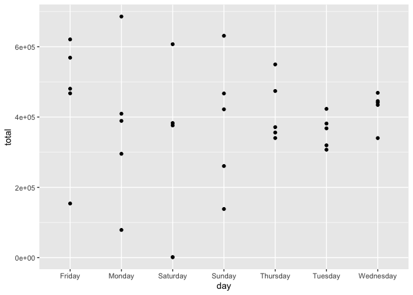
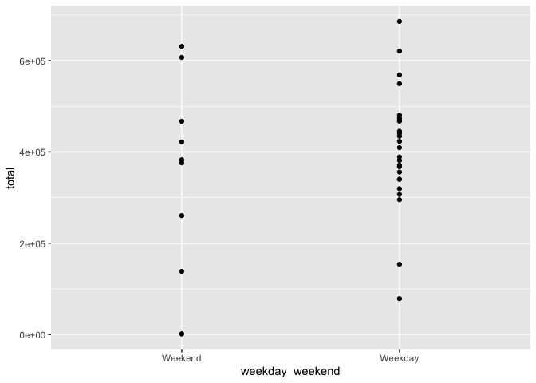
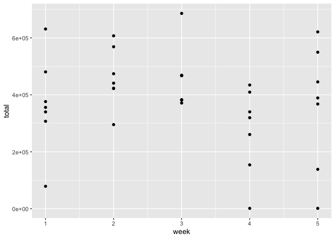

p8105\_hw3\_Ec3342
================
Ekta Chaudhary
12/10/2019

# Question 1

\#\#Loading the instacart dataset. Counting the number of aisles using
the count function. The total number of isles are given by
aisle\_order\_count. Finding out which aisles are the most items ordered
from.

``` r
library(p8105.datasets)
data("instacart")
insta_aisles = instacart %>% 
  count(aisle, name = "aisle_order_count") %>% #counting the number of aisles 
  arrange(desc(aisle_order_count)) #arranging the aisle_order_count by descending

# The maximum number of orders are placed from the fresh vegetables and fresh fruits aisle. 
```

\#Making a plot that shows the number of items ordered in each aisle,
limiting this to aisles with more than 10000 items ordered by using the
filter function to limit this to aisles with more than 10000 items.
aisle name is shown on y axis so that it is more legible.

``` r
insta_aisles %>% 
  filter(aisle_order_count > 10000) %>% 
  ggplot(aes(x = aisle_order_count, y = aisle)) + geom_point()
```

<!-- --> \#Creating a
table showing the three most popular items in each of the aisles “baking
ingredients”, “dog food care”, and “packaged vegetables
fruits”.Including the number of times each item is ordered.

``` r
instacart_new = instacart %>% 
  select(aisle_id, aisle, product_name) %>% #selected the variables aisle_id, aisle, product_name
  filter(
    aisle %in% c("baking ingredients", "dog food care", "packaged vegetables fruits")) %>% 
  #Filtered to include the aisles “baking ingredients”, “dog food care”, and “packaged vegetables fruits”
  count(aisle, product_name) %>% 
  group_by(aisle) %>% 
  top_n(3) 
```

    ## Selecting by n

\#Creating a table showing the mean hour of the day at which Pink Lady
Apples and Coffee Ice Cream are ordered on each day of the week;
formating this table for human readers (i.e. produce a 2 x 7 table).

``` r
icecream_apples = instacart %>% 
  filter(
    product_name %in% c("Pink Lady Apples", "Coffee Ice Cream")) %>% 
  select(
    order_dow, order_hour_of_day, product_name) %>%
  arrange(
    desc(order_dow)) %>% 
  group_by(
    order_dow) %>% 
  summarise(
    average_order_hour_of_day = mean(order_hour_of_day)) %>% 
  mutate(
    order_dow = recode(
      order_dow, `1` = 'Mon', `2` = 'Tues', `3` = 'Wed', `4` = 'Thur', `5` = 'Fri', `6` = 'Sat', `0` = 'Sun')) %>% 
  pivot_wider(
    names_from = order_dow, values_from = average_order_hour_of_day)
kable(icecream_apples)
```

|  Sun |      Mon |     Tues |      Wed |     Thur |      Fri |   Sat |
| ---: | -------: | -------: | -------: | -------: | -------: | ----: |
| 13.6 | 12.17391 | 12.83824 | 14.68519 | 13.17308 | 12.64286 | 13.25 |

\#Description of the instacart dataset\!

  - The instacart dataset consists of 1384617 rows and 15 columns.
  - Some of the key variables are order\_id, product\_name, aisle,
    aisle\_id, order\_number
  - The total number of aisles are 134.
  - The maximum number of orders are placed from the fresh vegetables
    and fresh fruits aisle.
  - The 3 most popular items ordered from these aisles are: Baking
    ingredients: Light brown sugar (499), pure baking soda (387), and
    cane sugar (336); dog food care: Snack Sticks Chicken & Rice Recipe
    Dog Treats (30), Organix Chicken & Brown Rice Recipe (28), Small Dog
    Biscuits (26); packaged vegetables fruits: Organic Baby Spinach
    (9784), Organic Raspberries (5546), Organic Blueberries (4966)

# Question 2

\#\#Loading the BRFSS data and cleaning the data. Formatted the data to
use appropriate variable names. Filtered the topic to “Overall Health”,
included only responses from “Excellent” to “Poor”, Organize responses
as a factor taking levels ordered from “Poor” to “Excellent”

``` r
data("brfss_smart2010") 
health = brfss_smart2010 %>% 
  janitor::clean_names() %>% #formatted the data to use appropriate variable names
  filter(
    topic == "Overall Health"
    ) %>% #focused on the “Overall Health” topic
  filter(
    response %in% c("Excellent","Very good","Good","Fair","Poor")
    ) %>% #included only responses from “Excellent”to “Poor”
  mutate(
    response = as.factor(response),
    response = fct_relevel(
      response, "Poor","Fair","Good","Very good","Excellent")
    ) %>% #organized responses as factors. 
  arrange(response) 
```

\#\#In 2002, which states were observed at 7 or more locations? What
about in 2010?

``` r
states_02 = 
  brfss_smart2010 %>%  
  janitor::clean_names() %>% #formatted the data to use appropriate variable names
  select(
    locationabbr, locationdesc, year
    ) %>% 
  filter(
    year == "2002"
    ) %>% #filtered to include only the year 2002
  group_by(
    locationabbr
    ) %>% 
  summarise(
    n_location = n_distinct(locationdesc) 
    ) %>%
  filter(n_location >= 7)

states_10 = 
  brfss_smart2010 %>%  
  janitor::clean_names() %>% #formatted the data to use appropriate variable names
  select(
    locationabbr, locationdesc, year) %>% 
  filter(
    year == "2010" #filtered to include only the year 2010
    ) %>%
  group_by(
    locationabbr
    ) %>% 
  summarise(
    n_location = n_distinct(locationdesc)
    ) %>%
  filter(n_location >= 7)

#Alternatively, we could have done this by taking 2002 and 2010 together as below:

states = 
  brfss_smart2010 %>% 
  janitor::clean_names() %>%
  select(
    locationabbr, locationdesc, year) %>% 
  filter(
    year %in% c("2002","2010")
    ) %>%
  group_by(
    year, locationabbr
    ) %>% 
  summarise(
    n_location = n_distinct(locationdesc)
    ) %>%
  filter(
    n_location >= 7
    )
```

  - In 2002, the states observed at 7 or more locations are : CT, FL,
    MA, NC, NJ, PA
  - In 2010, the states observed at 7 or more locations are : CA, CO,
    FL, MA, MD, NC, NE, NJ, NY, OH, PA, SC, TX, WA

\#Constructed a dataset that is limited to Excellent responses, and
contains, year, state, and a variable that averages the data\_value
across locations within a state.

``` r
excellent = brfss_smart2010 %>% 
  janitor::clean_names() %>%
  select(
    year, locationabbr, response, data_value
    ) %>% 
  filter(
    response == "Excellent"
    ) %>%
 group_by(
   year, locationabbr
   ) %>% 
  summarise(
    mean_val = mean(data_value)
    )
```

\#Making a “spaghetti” plot of this average value over time within a
state (that is, make a plot showing a line for each state across
years

``` r
ggplot(excellent, aes(x = year, y = mean_val, color = factor(locationabbr))) +   geom_line() +   theme_bw()
```

    ## Warning: Removed 3 rows containing missing values (geom_path).

<!-- -->

``` r
plot = brfss_smart2010 %>%
  janitor::clean_names() %>%
  filter(
    year %in% c("2006","2010")
  ) %>%
  select(
    year, locationabbr, response, data_value, locationdesc
    ) %>%
  drop_na() %>%
  filter(response %in% c("Excellent", "Very good", "Good", "Fair","Poor")
  ) %>%
  filter(locationabbr == "NY") %>%
  group_by(year, locationdesc, locationabbr) %>%
  ggplot(aes(x = response, y = data_value, fill = locationdesc)) +
  geom_bar(start = "identity", position = "dodge") +
  facet_grid(year ~.) +
  labs(x = "Response", y = "Data Value", title = "Distribution of responses among locations in NY")
```

    ## Warning: Ignoring unknown parameters: start

# Question 3

``` r
accel_data = read_csv(file = "./data/accel_data.csv") %>%
janitor::clean_names() %>%
mutate(
  weekday_weekend = factor((day %in% c('Monday', 'Tuesday', 'Wednesday', 'Thursday', 'Friday')),levels = c(FALSE, TRUE), labels = c('Weekend', 'Weekday')) 
) %>%
select(week, day_id, day, weekday_weekend, everything()) 
```

    ## Parsed with column specification:
    ## cols(
    ##   .default = col_double(),
    ##   day = col_character()
    ## )

    ## See spec(...) for full column specifications.

``` r
data = accel_data %>%
mutate(
  total = rowSums(select(.,-week,-day_id,-day,-weekday_weekend))
  ) %>%
  select(week, day_id, day, weekday_weekend, total)

ggplot(data, aes(x = day, y = total)) + geom_point()
```

<!-- -->

``` r
ggplot(data, aes(x = weekday_weekend, y = total)) + geom_point()
```

<!-- -->

``` r
ggplot(data, aes(x = week, y = total)) + geom_point()
```

<!-- -->
