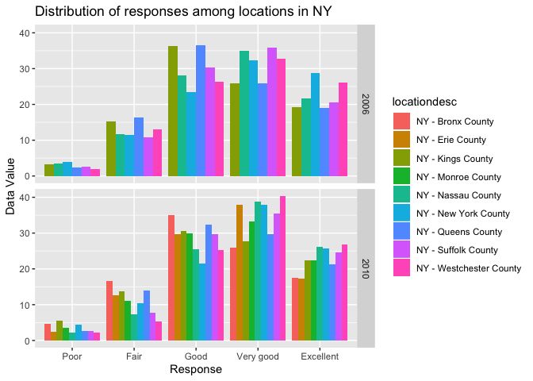

p8105\_hw3\_Ec3342
================
Ekta Chaudhary
12/10/2019

# Question 1

\#Loading the instacart dataset. Counting the number of aisles using the
count function. The total number of aisles are given by
aisle\_order\_count. Finding out which aisles are the most items ordered
from.

``` r
library(p8105.datasets)
data("instacart")
insta_aisles = instacart %>% 
  count(aisle, name = "aisle_order_count") %>% #counting the number of aisles 
  arrange(desc(aisle_order_count)) #arranging the aisle_order_count by descending

# The maximum number of orders are placed from the fresh vegetables and fresh fruits aisle. 
```

\#Making a plot that shows the number of items ordered in each aisle,
limiting this to aisles with more than 10000 items ordered by using the
filter function to limit this to aisles with more than 10000 items.
aisle name is shown on y axis so that it is more legible.

``` r
insta_aisles %>% 
  filter(aisle_order_count > 10000) %>% #limiting to aisles with more than 10000 items ordered.
  ggplot(aes(x = aisle_order_count, y = aisle)) + geom_point() #creating a scatter plot with aisle name on y axis to make it more legible.
```

<!-- -->

\#Creating a table showing the three most popular items in each of the
aisles “baking ingredients”, “dog food care”, and “packaged vegetables
fruits”.Including the number of times each item is ordered.

``` r
instacart_new = instacart %>% 
  select(aisle_id, aisle, product_name) %>% #selected the variables aisle_id, aisle, product_name
  filter(
    aisle %in% c("baking ingredients", "dog food care", "packaged vegetables fruits")) %>% 
  #Filtered to include the aisles “baking ingredients”, “dog food care”, and “packaged vegetables fruits”
  count(aisle, product_name) %>% 
  group_by(aisle) %>% 
  top_n(3) 
```

    ## Selecting by n

``` r
  kable(instacart_new)
```

| aisle                      | product\_name                                 |    n |
| :------------------------- | :-------------------------------------------- | ---: |
| baking ingredients         | Cane Sugar                                    |  336 |
| baking ingredients         | Light Brown Sugar                             |  499 |
| baking ingredients         | Pure Baking Soda                              |  387 |
| dog food care              | Organix Chicken & Brown Rice Recipe           |   28 |
| dog food care              | Small Dog Biscuits                            |   26 |
| dog food care              | Snack Sticks Chicken & Rice Recipe Dog Treats |   30 |
| packaged vegetables fruits | Organic Baby Spinach                          | 9784 |
| packaged vegetables fruits | Organic Blueberries                           | 4966 |
| packaged vegetables fruits | Organic Raspberries                           | 5546 |

\#Creating a table showing the mean hour of the day at which Pink Lady
Apples and Coffee Ice Cream are ordered on each day of the week;
formating this table for human readers (i.e. produce a 2 x 7 table).

``` r
icecream_apples = instacart %>% 
  filter(
    product_name %in% c("Pink Lady Apples", "Coffee Ice Cream")) %>% 
  select(
    order_dow, order_hour_of_day, product_name) %>%
  arrange(
    desc(order_dow)) %>% 
  group_by(
    order_dow) %>% 
  summarise(
    average_order_hour_of_day = mean(order_hour_of_day)) %>% 
  mutate(
    order_dow = recode(
      order_dow, `1` = 'Mon', `2` = 'Tues', `3` = 'Wed', `4` = 'Thur', `5` = 'Fri', `6` = 'Sat', `0` = 'Sun')) %>% 
  pivot_wider(
    names_from = order_dow, values_from = average_order_hour_of_day)
kable(icecream_apples)
```

|  Sun |      Mon |     Tues |      Wed |     Thur |      Fri |   Sat |
| ---: | -------: | -------: | -------: | -------: | -------: | ----: |
| 13.6 | 12.17391 | 12.83824 | 14.68519 | 13.17308 | 12.64286 | 13.25 |

Description of the instacart dataset\!

  - The instacart dataset consists of 1384617 rows and 15 columns.
  - Some of the key variables are order\_id, product\_name, aisle,
    aisle\_id, order\_number.
  - The total number of aisles are 134.
  - The maximum number of orders are placed from the fresh vegetables
    and fresh fruits aisle.
  - The 3 most popular items ordered from the Baking ingredients,dog
    food care and packaged vegetables fruits aisles are as follows:
    Baking ingredients: Light brown sugar (499), pure baking soda (387),
    and cane sugar (336); dog food care: Snack Sticks Chicken & Rice
    Recipe Dog Treats (30), Organix Chicken & Brown Rice Recipe (28),
    Small Dog Biscuits (26); packaged vegetables fruits: Organic Baby
    Spinach (9784), Organic Raspberries (5546), Organic Blueberries
    (4966)

# Question 2

\#Loading the BRFSS data and cleaning the data. Formatted the data to
use appropriate variable names. Filtered the topic to “Overall Health”,
included only responses from “Excellent” to “Poor”, Organized responses
as a factor taking levels ordered from “Poor” to “Excellent”

``` r
data("brfss_smart2010") 
health = brfss_smart2010 %>% 
  janitor::clean_names() %>% #formatted the data to use appropriate variable names
  filter(
    topic == "Overall Health", #focused on the “Overall Health” topic
    response %in% c("Excellent","Very good","Good","Fair","Poor") #included only responses from “Excellent”to “Poor”
    ) %>% 
  mutate(
    response = as.factor(response),
    response = fct_relevel(
      response, "Poor","Fair","Good","Very good","Excellent")
    ) %>% #organized responses as factors. 
  arrange(response) 
```

\#In 2002, which states were observed at 7 or more locations? What about
in 2010?

``` r
states_02 = 
  brfss_smart2010 %>%  
  janitor::clean_names() %>% #formatted the data to use appropriate variable names
  select(
    locationabbr, locationdesc, year
    ) %>% 
  filter(
    year == "2002"
    ) %>% #filtered to include only the year 2002
  group_by(
    locationabbr
    ) %>% 
  summarise(
    n_location = n_distinct(locationdesc) 
    ) %>%
  filter(n_location >= 7)

states_10 = 
  brfss_smart2010 %>%  
  janitor::clean_names() %>% #formatted the data to use appropriate variable names
  select(
    locationabbr, locationdesc, year) %>% 
  filter(
    year == "2010" #filtered to include only the year 2010
    ) %>%
  group_by(
    locationabbr
    ) %>% 
  summarise(
    n_location = n_distinct(locationdesc)
    ) %>%
  filter(n_location >= 7)
```

  - In 2002, the states observed at 7 or more locations are : CT, FL,
    MA, NC, NJ, PA
  - In 2010, the states observed at 7 or more locations are : CA, CO,
    FL, MA, MD, NC, NE, NJ, NY, OH, PA, SC, TX, WA

\#Constructed a dataset that is limited to Excellent responses, and
contains, year, state, and a variable that averages the data\_value
across locations within a state.

``` r
excellent = brfss_smart2010 %>% 
  janitor::clean_names() %>%
  select(
    year, locationabbr, response, data_value
    ) %>% 
  filter(
    response == "Excellent" #limiting the dataset to include only Excellent responses
    ) %>%
 group_by(
   year, locationabbr
   ) %>% 
  summarise(
    mean_val = mean(data_value) #variable that averages the data_value across locations within a state
    )
```

\#Making a “spaghetti” plot of this average value over time within a
state (that is, make a plot showing a line for each state across years.
This spaghetti plot looks
messy.

``` r
ggplot(excellent, aes(x = year, y = mean_val, color = factor(locationabbr))) +   geom_line() +   theme_classic()
```

    ## Warning: Removed 3 rows containing missing values (geom_path).

<!-- -->

\#Making a two-panel plot showing, for the years 2006, and 2010,
distribution of data\_value for responses (“Poor” to “Excellent”) among
locations in NY State.

``` r
plot = brfss_smart2010 %>%
  janitor::clean_names() %>%
  filter(
    year %in% c("2006","2010"),
    response %in% c("Excellent", "Very good", "Good", "Fair","Poor")
    ) %>%
  select(
    year, locationabbr, response, data_value, locationdesc
    ) %>%
  drop_na() %>%
  mutate(
    response = as.factor(response),
    response = fct_relevel(
      response, "Poor","Fair","Good","Very good","Excellent")
    ) %>%
  filter(locationabbr == "NY") %>%
  group_by(year, locationdesc, locationabbr)
```

``` r
ggplot(plot, aes(x = response, y = data_value, fill = locationdesc)) +
  geom_bar(stat = "identity", position = "dodge") +
  facet_grid(year ~.) +
  labs(x = "Response", y = "Data Value", title = "Distribution of responses among locations in NY")
```

<!-- -->

# Question 3

\#Load, tidy, and otherwise wrangle the data. Your final dataset should
include all originally observed variables and values; have useful
variable names; include a weekday vs weekend variable; and encode data
with reasonable variable classes. Describe the resulting dataset
(e.g. what variables exist, how many observations,
etc).

``` r
accel_data = read_csv(file = "./data/accel_data.csv") %>% #reading the csv file
janitor::clean_names() %>% #cleaning variable names 
mutate(
  wkday_wkend = factor((day %in% c('Monday', 'Tuesday', 'Wednesday', 'Thursday', 'Friday')),
                       levels = c(FALSE, TRUE), 
                       labels = c('Weekend', 'Weekday'))
) %>%
  select(week, day_id, day, wkday_wkend, everything())
```

    ## Parsed with column specification:
    ## cols(
    ##   .default = col_double(),
    ##   day = col_character()
    ## )

    ## See spec(...) for full column specifications.

Description of accel\_data:

  - The dataset represents 35 observations of 1444 variables.
  - The dataset has the following variables:
    1)  week which is a numeric variable; 1 represents week1, 2
        represents week2, 3 represents week3, 4 represents week4 and 5
        represents week5.
    2)  day\_id which is a numeric variable.
    3)  day which is a character variable.
    4)  wkday\_wkend which is a factor variable with 2 levels - Weekday,
        Weekend.
    5)  activity\_1 to activity\_1440 which are numeric variable.

\#Using your tidied dataset, aggregate accross minutes to create a total
activity variable for each day, and create a table showing these totals.
Are any trends apparent?

``` r
accel_data %>%
mutate(
  total_act = rowSums(select(.,activity_1:activity_1440)) #created a total_act variable that aggregates across minutes
  ) %>%
  select(week, day_id, day, wkday_wkend, total_act) %>% 
  mutate(
    day_int = case_when(
      day == "Monday" ~ 1,
      day == "Tuesday" ~ 2,
      day == "Wednesday" ~ 3,
      day == "Thursday" ~ 4,
      day == "Friday" ~ 5,
      day == "Saturday" ~ 6,
      day == "Sunday" ~ 7
    )) %>%
  arrange(week, day_int) %>% 
  select(week, day, total_act) %>%
  pivot_wider(names_from = week, values_from = total_act) %>%
  kable()
```

| day       |         1 |      2 |      3 |      4 |      5 |
| :-------- | --------: | -----: | -----: | -----: | -----: |
| Monday    |  78828.07 | 295431 | 685910 | 409450 | 389080 |
| Tuesday   | 307094.24 | 423245 | 381507 | 319568 | 367824 |
| Wednesday | 340115.01 | 440962 | 468869 | 434460 | 445366 |
| Thursday  | 355923.64 | 474048 | 371230 | 340291 | 549658 |
| Friday    | 480542.62 | 568839 | 467420 | 154049 | 620860 |
| Saturday  | 376254.00 | 607175 | 382928 |   1440 |   1440 |
| Sunday    | 631105.00 | 422018 | 467052 | 260617 | 138421 |

\*There is no apparent trend seen, looking at the table.

\#Making a single-panel plot that shows the 24-hour activity time
courses for each day and use color to indicate day of the week. Describe
in words any patterns or conclusions you can make based on this graph.

``` r
accel_data %>%
  mutate(total_act = rowSums(select(.,activity_1:activity_1440))
         ) %>%
  select(
    week, day_id, day, wkday_wkend, total_act
    ) %>%
  ggplot(
    aes(x = week, y = total_act, color = day)
    ) +
  geom_point() +
  geom_smooth(size = 0.5, se = FALSE) +
  theme(legend.position = "bottom") +
  labs(x = "Week", y = "Activity count per day") +
  scale_y_continuous(labels = scales::comma)
```

<!-- -->

  - There is a lot of variation in the activity pattern for each day.
  - On Week 1, the total activity on Monday was low but the total
    activity on Monday increased on Week 3.
  - On Week 4 and Week 5, the total activity on Saturday has appreciable
    decreased.
