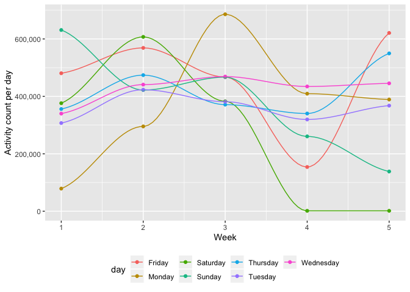

p8105\_hw3\_Ec3342
================
Ekta Chaudhary
12/10/2019

# Question 1

\#\#Loading the instacart dataset. Counting the number of aisles using
the count function. The total number of isles are given by
aisle\_order\_count. Finding out which aisles are the most items ordered
from.

``` r
library(p8105.datasets)
data("instacart")
insta_aisles = instacart %>% 
  count(aisle, name = "aisle_order_count") %>% 
  arrange(desc(aisle_order_count))
```

\#Making a plot that shows the number of items ordered in each aisle,
limiting this to aisles with more than 10000 items ordered by using the
filter function to limit this to aisles with more than 10000 items.
aisle name is shown on y axis so that it is more legible.

``` r
insta_aisles %>% 
  filter(aisle_order_count > 10000) %>% 
  ggplot(aes(x = aisle_order_count, y = aisle)) + geom_point()
```

<!-- --> \#Creating a
table showing the three most popular items in each of the aisles “baking
ingredients”, “dog food care”, and “packaged vegetables
fruits”.Including the number of times each item is ordered.

``` r
instacart_new = instacart %>% 
  select(aisle_id, aisle, product_name) %>% 
  filter(aisle %in% c("baking ingredients", "dog food care", "packaged vegetables fruits")) %>%
  count(aisle, product_name) %>% 
  group_by(aisle) %>% 
  top_n(3) 
```

    ## Selecting by n

\#Creating a table showing the mean hour of the day at which Pink Lady
Apples and Coffee Ice Cream are ordered on each day of the week;
formating this table for human readers (i.e. produce a 2 x 7 table).

``` r
icecream_apples = instacart %>% 
  filter(product_name %in% c("Pink Lady Apples", "Coffee Ice Cream")) %>% 
  select(order_dow, order_hour_of_day, product_name) %>%
  arrange(desc(order_dow)) %>% 
  group_by(order_dow) %>% 
  summarise(average_order_hour_of_day = mean(order_hour_of_day)) %>% 
  mutate(
    order_dow = recode(
      order_dow, `1` = 'Mon', `2` = 'Tues', `3` = 'Wed', `4` = 'Thur', `5` = 'Fri', `6` = 'Sat', `0` = 'Sun')
    ) %>% 
  pivot_wider(names_from = order_dow, values_from = average_order_hour_of_day)
kable(icecream_apples)
```

|  Sun |      Mon |     Tues |      Wed |     Thur |      Fri |   Sat |
| ---: | -------: | -------: | -------: | -------: | -------: | ----: |
| 13.6 | 12.17391 | 12.83824 | 14.68519 | 13.17308 | 12.64286 | 13.25 |

\#Description of the instacart dataset\!

  - The instacart dataset consists of 1384617 rows and 15 columns.
  - Some of the key variables are order\_id and product\_name
  - The total number of aisles are 134.
  - The maximum number of orders are placed from the fresh vegetables
    and fresh fruits aisle.
  - The 3 most popular items ordered from these aisles are: Baking
    ingredients: Light brown sugar (499), pure baking soda (387), and
    cane sugar (336); dog food care: Snack Sticks Chicken & Rice Recipe
    Dog Treats (30), Organix Chicken & Brown Rice Recipe (28), Small Dog
    Biscuits (26); packaged vegetables fruits: Organic Baby Spinach
    (9784), Organic Raspberries (5546), Organic Blueberries (4966)

# Question 2

``` r
data("brfss_smart2010") 
health = brfss_smart2010 %>% 
  janitor::clean_names() %>% 
  filter(topic == "Overall Health") %>% 
  filter(response %in% c("Poor","Fair","Good","Very good","Excellent")) 
 health$response = factor(health$response,levels = c("Poor","Fair","Good","Very good","Excellent"))
health = arrange(health,response)
```

``` r
data("brfss_smart2010") 
states = brfss_smart2010 %>% 
  janitor::clean_names() %>%
  select(locationabbr, locationdesc, year) %>% 
  filter(year %in% c("2002","2010")) %>%
  group_by(year, locationabbr) %>% 
  summarise(n_location = n_distinct(locationdesc)) %>%
  filter(n_location >= 7)
```

``` r
data("brfss_smart2010") 
excellent = brfss_smart2010 %>% 
  janitor::clean_names() %>%
  select(year, locationabbr, response, data_value) %>% 
  filter(response == "Excellent") %>%
 group_by(year, locationabbr) %>% 
  summarise(mean_val = mean(data_value)) 
```

``` r
ggplot(excellent, aes(x = year, y = mean_val, color = factor(locationabbr))) +   geom_line() +   theme_bw()
```

    ## Warning: Removed 3 rows containing missing values (geom_path).

<!-- -->
